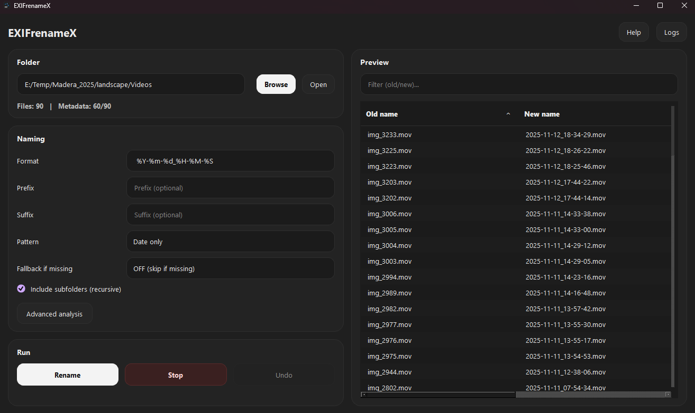
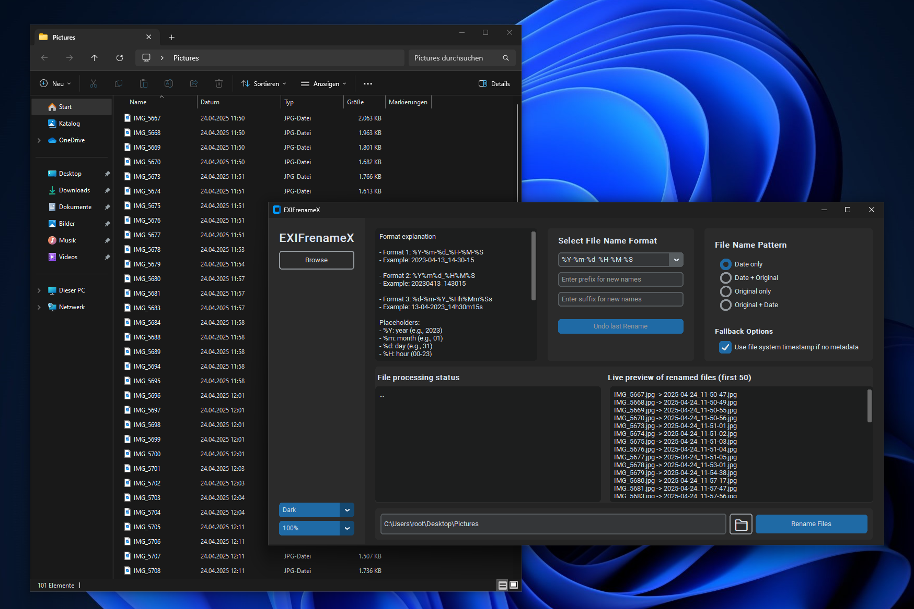
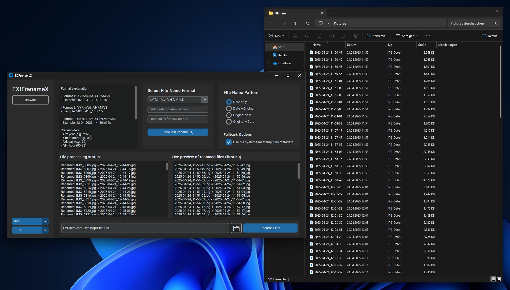

# EXIFrenameX  

> **A smart batch renamer for images & videos – powered by metadata, designed for Windows.**  
> Rename your photos & videos automatically based on EXIF, XMP, or recording date. Modern GUI, live preview, undo support.

---

## Features

- **Batch Rename:** Rename hundreds of images and videos in one go, with custom naming patterns.
- **Metadata-Based:** Extracts date/time from EXIF, XMP, or video media metadata (fallback to file system if missing).
- **Live Preview:** Instantly see how your files will be renamed – first 50 results shown in real time.
- **Flexible Naming:** Supports prefix, suffix, date/time formatting, and merge options for original filenames.
- **Undo Support:** Roll back the last rename operation with one click.
- **Modern GUI:** Clean, intuitive interface with light/dark mode and DPI scaling.
- **Safe:** Handles duplicate names, never overwrites files without warning.
- **Windows-Ready:** Delivered as a portable `.exe` no Python install needed.

---

---

## Screenshots

### Before Renaming



*Original folder view: File names are unsorted and not descriptive.*

---

### After Renaming



*Files after batch renaming with EXIFrenameX: All files are named by their recording date, clean and consistent.*

---

## Getting Started

### Download

1. Download the latest `.exe` release from [GitHub Releases](https://github.com/Ch4r0ne/EXIFrenameX/releases).
2. Extract and run `EXIFrenameX.exe` on your Windows machine.

_No Python installation or additional dependencies required!_

### For Developers

Clone and run locally:
```bash
git clone https://github.com/Ch4r0ne/EXIFrenameX.git
cd EXIFrenameX
pip install -r requirements.txt
python EXIFrenameX.pyw
```

## Usage Guide

### 1. Select a Folder  
Click **Browse** to select the directory containing your photos/videos.

### 2. Choose a Naming Format  
Select a date/time format from the dropdown. Add optional prefix/suffix as needed.

### 3. Select Merge Mode  
Choose how the new name should combine with the original name:
- Date only
- Date + Original
- Original only
- Original + Date

### 4. Preview  
See the preview box for the first 50 file rename results, updated live as you change options.

### 5. Rename  
When satisfied, click **Rename Files**. Undo is available if you need to roll back.

---

## Supported File Types

- **Images:**  
  `.jpg`, `.jpeg`, `.png`, `.heic`, `.tiff`, `.bmp`, `.arw`, `.nef`, `.cr2`, `.orf`, `.rw2`, `.rwl`, `.srw`
- **Videos:**  
  `.mp4`, `.mov`, `.3gp`, `.avi`, `.mkv`, `.mts`, `.m2ts`, `.wmv`

> **Note:** Most RAW image types and common video formats are supported. The app falls back to file system date if metadata is missing.

---

## FAQ

**Q: What if files have no metadata?**  
A: The app can use the file system creation/modification date as a fallback (enable/disable in options).

**Q: Will my files be overwritten?**  
A: No, the app will never overwrite existing files. In case of duplicate names, a number is appended automatically.

**Q: How can I undo a rename operation?**  
A: Click the **Undo last Rename** button to revert the previous batch.

---

## Troubleshooting

- **App won't start:**  
  - Ensure all files from the release `.zip` are extracted.
  - Try running as administrator if accessing protected folders.
- **Some files not renamed:**  
  - Check if they are supported file types.
  - Check for missing metadata (see FAQ above).
- **Still issues?**  
  - See `exifrenamex.log` for details, or [open an issue](https://github.com/Ch4r0ne/EXIFrenameX/issues).

---

## Development

Want to contribute?  
- Code style: [PEP8](https://www.python.org/dev/peps/pep-0008/), modular, clear docstrings.
- See [`CONTRIBUTING.md`](CONTRIBUTING.md) for setup, code guidelines, and feature requests.

**Key dependencies:**  
```powershell
# Windows (onefile) – EXIFrenameX + Assets inkl. exiftool.exe (mit Subordnern)
py -m PyInstaller --noconfirm --clean --windowed --onefile `
  --name "EXIFrenameX" `
  --icon ".\assets\EXIFrenameX.ico" `
  --add-data ".\assets;assets" `
  --add-data ".\assets\exiftool;assets\exiftool" `
  --collect-all "PyQt6" `
  --hidden-import "PyQt6.QtCore" `
  --hidden-import "PyQt6.QtGui" `
  --hidden-import "PyQt6.QtWidgets" `
  --hidden-import "PyQt6.sip" `
  --hidden-import "PIL._imaging" `
  --hidden-import "pillow_heif" `
  --hidden-import "pymediainfo" `
  --hidden-import "exifread" `
  --hidden-import "exiftool_wrapper" `
  ".\EXIFrenameX.py"
```

---

## License

[MIT License](LICENSE)

---

## Credits

- Inspired by real-world batch photo organizing challenges.
- Powered by open-source Python packages.
- UI built with [CustomTkinter](https://github.com/TomSchimansky/CustomTkinter).

---

**Questions, feedback, or feature requests?**  
Open an [issue](https://github.com/Ch4r0ne/EXIFrenameX/issues) or start a discussion!
