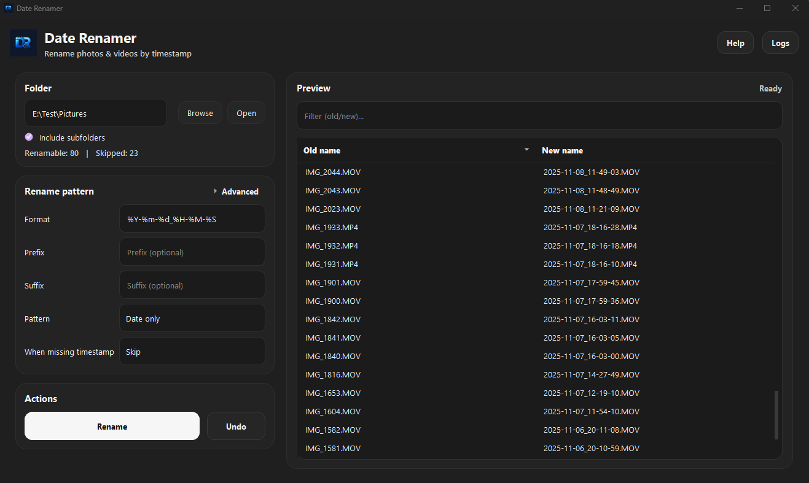

[](https://github.com/Ch4r0ne/date-renamer/releases)
[](https://github.com/Ch4r0ne/date-renamer/commits/main)
[](https://github.com/Ch4r0ne/date-renamer/actions)
[](LICENSE)


# Date Renamer Toolkit

Rename photos and videos **deterministically** using the **best available capture timestamp** with full transparency about *where the timestamp came from*.

> **Core principle:** predictable results, safe renames, and a preview that always explains the chosen timestamp source.



---

## Why this exists

Most media folders contain a mix of:
- **proper EXIF/QuickTime metadata**
- **stripped messenger exports**
- **Google Takeout exports with sidecars**
- **files named by camera apps (DJI, IMG/VID, WhatsApp)**
- **videos where only MediaInfo knows the truth**

Date Renamer resolves timestamps using a strict precedence order and shows the decision directly in the UI tooltip. That makes the rename output **auditable** and **repeatable**.

---

## Download

### ✅ Recommended (no Python required)

1. Open **Releases** and download the latest build.
2. Start the app:
   - Windows: `.exe`
   - macOS: `.app`
3. Done — release builds are standalone.

---

## Features

### 🧠 Deterministic timestamp resolution
- Consistent precedence order, mirrors the actual code path.
- Tooltip shows the exact timestamp source (e.g. `exiftool:QuickTime:CreateDate`).

### 👀 Live preview before you touch anything
- See old/new names instantly.
- Built-in filter for large folders.

### 🛡️ Safe renaming
- Auto-conflict handling: produces unique names when collisions occur.
- Skips files without usable timestamp (unless you choose a fallback mode).

### ↩️ Undo support
- Undo for the **last rename run** (current session).

### ⚡ Performance for big folders
- Parallel scan mode for large directories.
- ExifTool batch calls (many files per call) for speed.

### 🧩 Deep mode for “metadata-poor” exports
- Parse known filename patterns (DJI, IMG/VID, WhatsApp, generic stamps).
- Read `.xmp` sidecars.
- Read Google Takeout `.json` sidecars.

---

## How timestamp resolution works

For every file, Date Renamer selects the first usable timestamp in this order:

1. **ExifTool tags** (QuickTime / EXIF / XMP / Composite / PNG)
2. **Google Takeout JSON sidecar**
3. **XMP sidecar**
4. **Classic EXIF parsing** via `exifread` (images)
5. **HEIC embedded XMP** (Pillow + pillow-heif)
6. **MediaInfo** (videos)
7. **Filename parsing** (Deep mode)
8. **Filesystem fallback** (Created/Modified) — *only if selected*
9. Otherwise: **skip the file**

✅ The selected source is visible in the preview tooltip.

<details>
<summary><strong>ExifTool tags checked</strong></summary>

- EXIF:DateTimeOriginal  
- EXIF:CreateDate  
- XMP:CreateDate  
- XMP:DateCreated  
- QuickTime:CreateDate  
- QuickTime:MediaCreateDate  
- QuickTime:TrackCreateDate  
- QuickTime:ModifyDate  
- QuickTime:ContentCreateDate  
- Composite:SubSecDateTimeOriginal  
- Composite:DateTimeCreated  
- PNG:CreationTime  
- DateTimeOriginal (fallback)  
- CreateDate (fallback)  
- MediaCreateDate (fallback)  

</details>

---

## Deep mode

Deep mode extends timestamp detection beyond embedded metadata.

### ✅ Sidecars supported
- `file.ext.xmp` or `file.xmp`
- `file.ext.json` (Google Takeout)

### ✅ Recognized filename patterns

Examples (conceptual):

- `DJI_FLY_YYYYMMDD_HHMMSS_*`
- `DJI_YYYYMMDD_HHMMSS_*`
- `IMG_YYYYMMDD_HHMMSS*` / `VID_YYYYMMDD_HHMMSS*`
- `YYYYMMDD_HHMMSS*`
- `YYYY-MM-DD_HH-MM-SS*`
- `IMG-YYYYMMDD-WA####*` / `VID-YYYYMMDD-WA####*`

> Date-only patterns resolve to midnight when no time part exists.

---

## Naming patterns

You control naming via:
- **Format** (e.g. `%Y-%m-%d_%H-%M-%S`)
- **Prefix / Suffix**
- **Pattern**:
  - `Date only`
  - `Date + Original`
  - `Original only`
  - `Original + Date`

If a file has no timestamp:
- default: **skipped**
- optional: **filesystem fallback** (created/modified)

---

## Known limitations

### Messenger exports / transcoded files
Some exports remove capture metadata entirely. In those cases, recovery is only possible with:
- sidecars (XMP/Takeout JSON), or
- filename patterns, or
- filesystem fallback (usually *import/download time*, not capture time)

### UUID-style filenames
UUID names often indicate “exported” or “processed” media. Without metadata/sidecars:
- only filesystem fallback remains
- accuracy depends on your file history

---

## Run from source (developer)

#### 1) Create a virtual environment
```bash
python -m venv .venv
```

```bash
# Windows
.venv\Scripts\activate
```

```bash
# macOS/Linux
source .venv/bin/activate
```

```bash
pip install -r requirements.txt
```

```bash
python date-renamer.py
```


## Troubleshooting

1. Open Logs from the app menu.
2. Copy the log output.
3. Attach it to a GitHub issue.

Common cases:

- ExifTool not found or wrong mode selection.
- No timestamp available (use fallback or Deep mode).
- Permission or rename failure (Windows file locks).

The preview tooltip always shows the selected timestamp source.

## Build (PyInstaller)

Prerequisites:

- Python 3.10+
- PyInstaller (`pip install pyinstaller`)

Build commands:

```bash
# Windows
py -m PyInstaller date-renamer.spec
```

```bash
# macOS
python3 -m PyInstaller date-renamer.spec
```

Output is written to `dist/DateRenamer`.

Bundled assets are taken from `assets/` and `tools/` (if present).
ExifTool resolution order is bundled first, then system PATH.

## Credits

- Built with PyQt6 and community-maintained Python packages.

## Support

Open an issue at https://github.com/Ch4r0ne/date-renamer/issues with logs and a sample
file list if you need help reproducing a timestamp issue.


## License

[MIT License](LICENSE)
