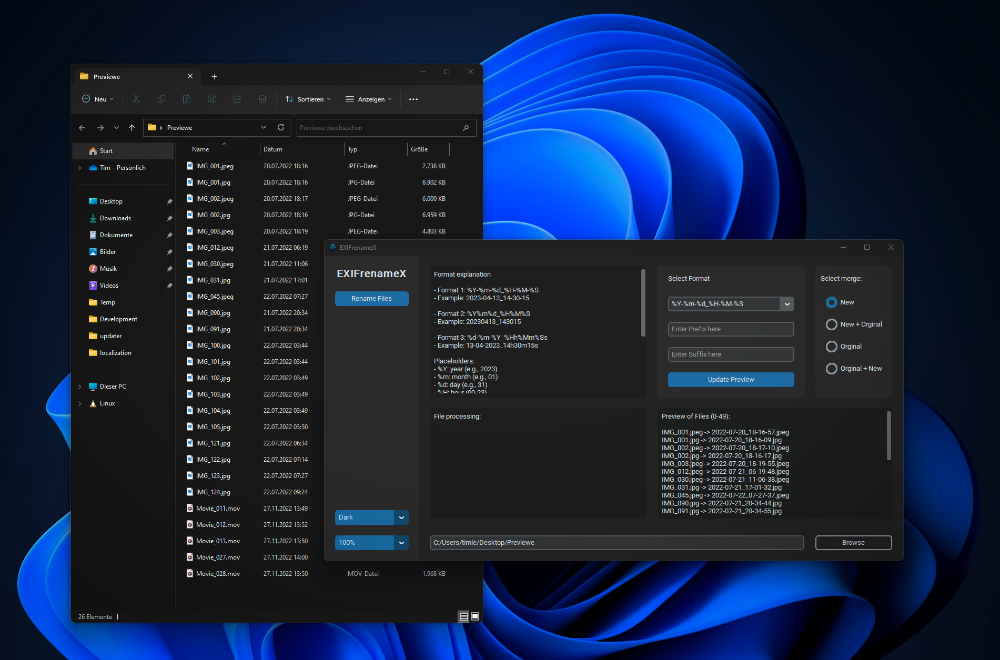

# EXIFrenameX

This application renames image and video files based on their metadata (e.g. date taken/created) using a user-defined format. It supports renaming multiple files at once and allows users to preview the new names before renaming the files.
How to use

### To use this application, simply run the .exe file and follow these steps

1. Click the Browse button and select the folder containing the files you want to rename.
2. Select a format from the drop-down list in the Select Format section. The format determines how the date/time information is used in the new file names. You can also specify a prefix and/or suffix for the new file names.
3. Select one of the four options in the 'Select merge' section to decide whether to merge the original file name with the new name, or replace it entirely.
4. Click the Update Preview button to see how the new names will look. The first 50 files in the folder will be displayed.
5. If you are happy with the preview, click the 'Rename Files' button to rename the files.

### Dark Mode Windows 11 Design

### Supported file types
- JPEG images (.JPG / .JPEG)
- PNG images (.PNG)
- Sony RAW images (.ARW)
- Nikon RAW images (.NEF)
- TIFF images (.TIFF / .TIF)
- Canon RAW images (.CR2)
- Olympus RAW images (.ORF)
- Panasonic RAW images (.RW2)
- Leica RAW images (.RWL)
- Samsung RAW images (.SRW)
- QuickTime video (.MOV)
- MPEG-4 video (.MP4)
